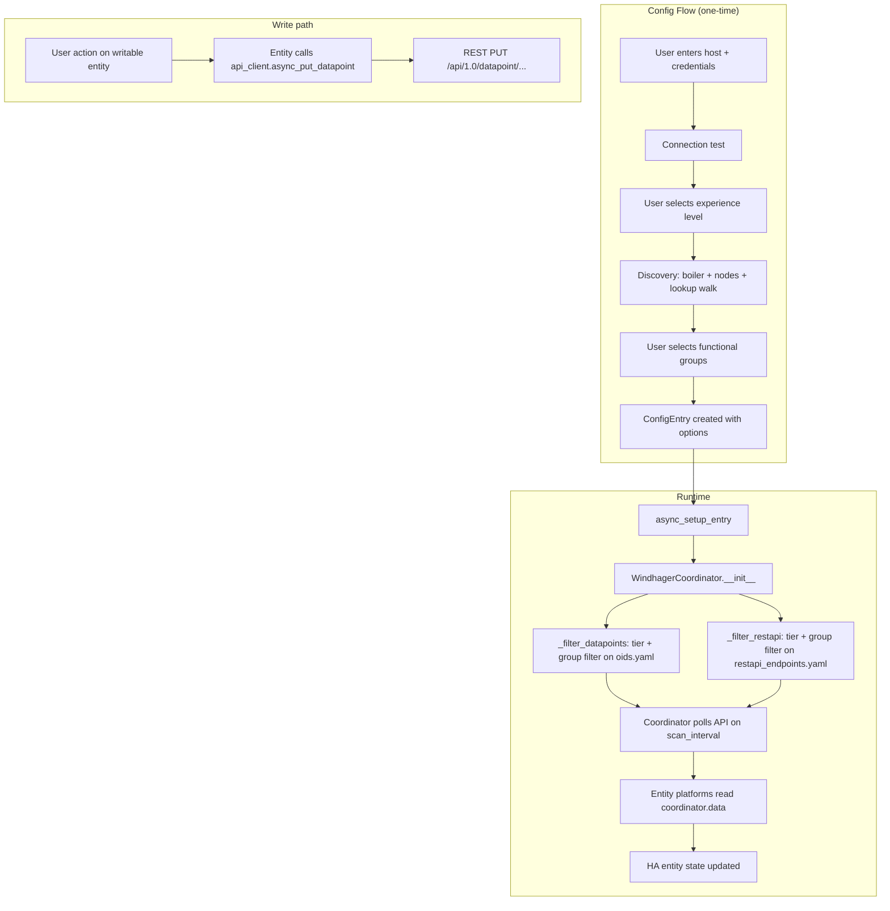

# Integration Architecture

This document describes the internal structure of the Windhager Home Assistant
integration for contributors and developers who want to understand or extend it.

## Module Map

```
custom_components/windhager_unified/
├── __init__.py           Entry point — config entry setup/unload, set_datapoint service
├── api_client.py         Async HTTP client; Digest auth; all raw API calls
├── config_flow.py        Multi-step UI config flow + OptionsFlow
├── const.py              All constants, including EXPERIENCE_TIERS
├── coordinator.py        DataUpdateCoordinator; filtering by tier + groups
├── diagnostics.py        Redacted diagnostics for support
├── discovery.py          Runtime LON discovery; boiler detection; group classification
├── exceptions.py         Typed exceptions (Auth, Connection, Timeout, Parsing, Unsupported)
├── labels/
│   ├── __init__.py       LabelCatalog — XML label loading + optional device refresh
│   └── *.xml             Bundled label files (vendor XML from the device)
├── sensor.py             Sensor platform (LON + REST read-only)
├── switch.py             Switch platform (writable boolean LON datapoints)
├── button.py             Button platform (writable trigger LON datapoints)
├── select.py             Select platform (writable enum LON datapoints)
├── oids.yaml             Static LON OID mapping with group + experience_minimum
└── restapi_endpoints.yaml Static REST endpoint mapping with group + experience_minimum
```

## Data Flow



## Key Design Decisions

### ConfigEntry vs options

Integration settings are split deliberately:

- `entry.data` holds immutable connection fields: `host`, `username`, `password`.
- `entry.options` holds user-tunable fields: `experience_level`, `groups`,
  `scan_interval`, `verify_ssl`, `refresh_labels_from_device`.

This allows the OptionsFlow to change preferences without requiring a full
re-authentication.

### DataUpdateCoordinator filtering

The coordinator filters `oids.yaml` and `restapi_endpoints.yaml` once at
startup (in `__init__`) based on the configured `experience_level` and
`selected_groups`. Only the surviving datapoints are polled. This means:

- Adding a more permissive experience level immediately increases poll load.
- Changing tier/groups triggers an entry reload, which rebuilds the filtered set.

### Experience tier ordering

Tiers are stored as an ordered tuple in `const.EXPERIENCE_TIERS`:

```python
("essential", "comfort", "advanced", "expert", "service")
```

A datapoint's `experience_minimum` field names the minimum tier a user must
select to see it. The coordinator's `_passes_tier` helper compares ordinal
indices.

### Entity default enablement

Entities at tier `advanced` or below are enabled by default. Entities at
`expert` or `service` are registered as disabled, letting power users opt in
via the HA entity registry without polluting the default dashboard.

## Threading / async model

All I/O runs on the HA event loop via `aiohttp`. The `WindhagerApiClient`
opens one `aiohttp.ClientSession` per config entry and closes it on unload.
No blocking I/O is performed in the event loop. `_load_yaml` and
`LabelCatalog.load` read files synchronously during coordinator initialisation
(before the first poll), which is acceptable because they run in
`async_setup_entry` before polling begins.

## Error handling

All API call failures are propagated via typed exceptions defined in
`exceptions.py`. The coordinator wraps `_async_update_data` inside the HA
`UpdateFailed` pattern so partial failures are recorded without crashing HA.
404 responses during polling populate `coordinator.unknown_oids` for
diagnostics rather than raising.
