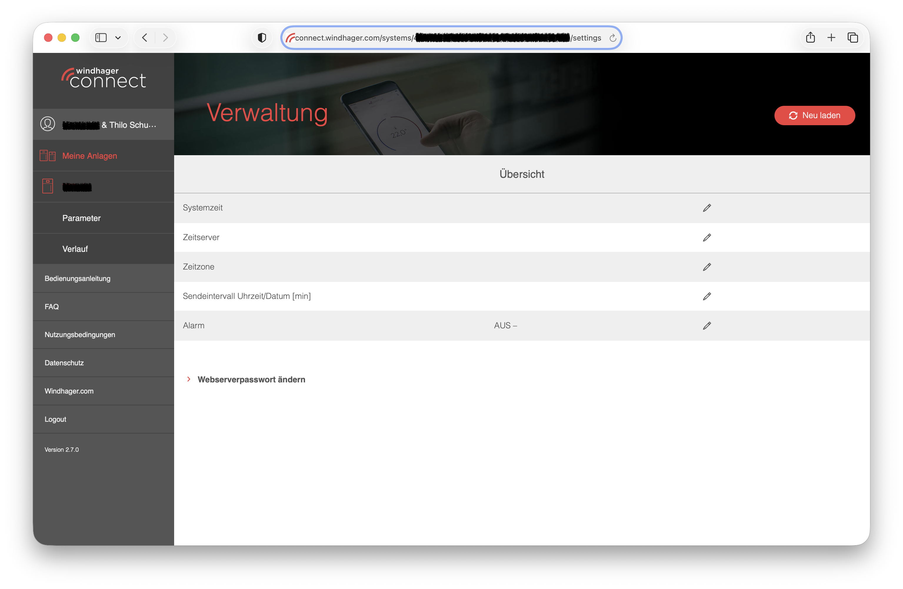
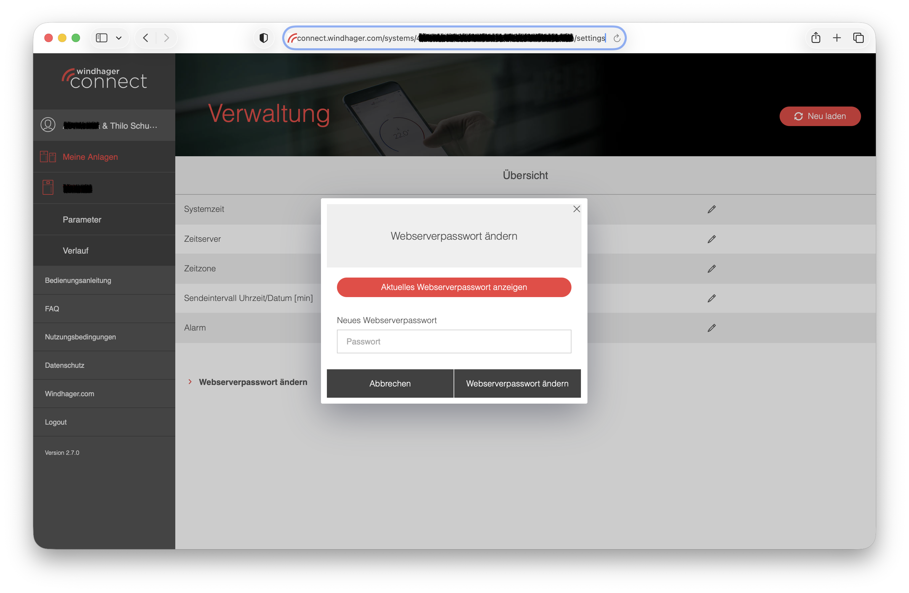

# Setup walkthrough

After [installing](installation.md) the integration, add it through the Home
Assistant UI.

---

## Step 1 — Credentials

Go to **Settings → Devices & Services → Add Integration → Windhager Unified**.

### Host address

Enter the local IP address or hostname of your Windhager web server. You do **not**
need to add `http://` or `https://` — the integration tries **HTTP (port 80) first**,
then HTTPS automatically.

| What you type | What happens |
|---|---|
| `192.0.2.10` | HTTP tried first, HTTPS as fallback |
| `windhager.local` | Same auto-detection |
| `http://192.0.2.10` | HTTP used directly |
| `https://192.0.2.10` | HTTPS used directly |

> **Tip:** most Windhager RC7030 web servers run plain HTTP on port 80.
> If yours is configured for HTTPS with a self-signed certificate, uncheck
> **Verify SSL Certificate** to skip certificate validation.

### Username

Three accounts are available on the Windhager web server:

| Username | Typical use |
|---|---|
| `USER` | Read-only access, limited parameters |
| `Service` | Read + write; recommended for this integration |
| `OEM` | Full access including OEM-only parameters |

**Recommendation:** use `Service`. It provides enough access for all experience
levels up to and including *Expert*. You only need `OEM` if you know you need
parameters that are hidden from the Service account.

### Password

There are two scenarios depending on whether your system is connected to the
Windhager Connect online service.

#### Scenario A — standalone (not connected to Windhager Connect)

The factory default password is **`123`** for all user accounts.

#### Scenario B — system registered on Windhager Connect

When a system is registered on `connect.windhager.com`, the Connect service
automatically sets a unique web server password. The default `123` will no
longer work.

**How to retrieve your password from Windhager Connect:**

1. Log in at [connect.windhager.com](https://connect.windhager.com).
2. Click on your system under "Meine Anlagen".
3. The browser shows a URL ending in `/management`. **Edit the URL directly** and
   replace `management` with `settings`:

   ```
   …/systems/<id>/management  →  …/systems/<id>/settings
   ```

   Press Enter — the settings page opens.

   

4. Click **"Webserverpasswort ändern"** (Change web server password).

   A dialog opens:

   

5. Click **"Aktuelles Webserverpasswort anzeigen"** (Show current web server
   password) to reveal the current password.
6. Copy this password and use it in the Home Assistant setup wizard.

> **Security note:** the web server password is separate from your Windhager
> Connect login. You do not need to change it — just read and copy the
> existing one.

---

## Step 2 — Experience level

Choose how much detail you want. See [Experience levels](experience-levels.md)
for a full description. The default **Essential** gives a clean dashboard with
the most useful temperatures and operating state.

---

## Step 3 — Discovery

The integration connects to the device, runs the LON topology walk
(`/api/1.0/lookup` and `/api/1.0/nodes`), and detects the boiler family.
This typically takes a few seconds.

If discovery fails (e.g. transient network error) a retry button is shown.
You do not need to re-enter credentials.

---

## Step 4 — Groups

The wizard shows the LON functional groups found on your device. The groups
that are checked by default depend on your experience level. You can check or
uncheck any group.

| Group (example) | Default for Essential | Default for Comfort+ |
|---|---|---|
| Boiler summary | ✔ | ✔ |
| Heating circuit 1 | ✔ | ✔ |
| Heating circuit 2+ | — | ✔ |
| DHW | — | ✔ |
| Buffer | — | ✔ |
| Cascade | — | — |
| Solar | — | — |
| Error log / Heartbeat | — | ✔ (Advanced+) |
| Maintenance / Firmware | — | ✔ (Service) |

---

## Step 5 — Done

The integration creates entities. Devices appear under **Settings → Devices &
Services → Windhager Unified**.

---

## Changing settings later

Open **Settings → Devices & Services → Windhager Unified → Configure (gear icon)**
to change the experience level, groups, scan interval, SSL setting, or to
trigger a label refresh from the device.

---

## Troubleshooting

See [troubleshooting.md](troubleshooting.md) for common problems (wrong password,
no entities, SSL errors, etc.).
